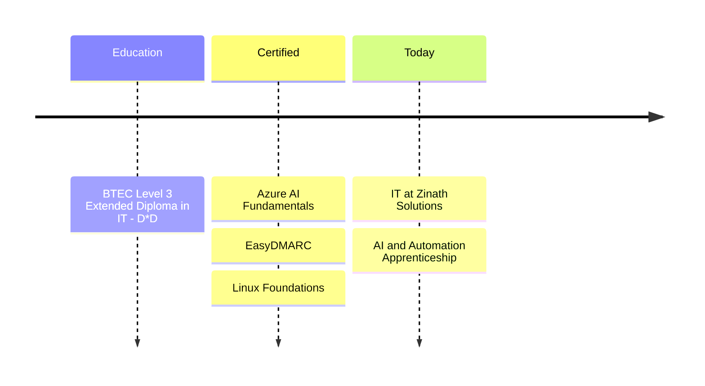

# Hi, I'm Zaafir 👋

**IT Professional · Cloud, Security & Automation**  
London, UK

---

## About me

I work in IT at **Zinath Solutions Limited**, a managed service provider, helping businesses keep their Microsoft 365, user accounts, devices and email secure and running smoothly.

Alongside work, I'm doing an **AI & Automation apprenticeship**, learning how to use AI and automation to make IT simpler.

---

## What I do

<table>
  <tr>
    <td width="33%" valign="top">
      <b>☁️ Cloud & Identity</b>  
      Managing Microsoft 365, Entra ID user accounts and Intune devices.
    </td>
    <td width="33%" valign="top">
      <b>🔐 Email Security</b>  
      Setting up DMARC, SPF and DKIM to protect domains from spoofing.
    </td>
    <td width="33%" valign="top">
      <b>🛠️ IT Support</b>  
      Service desk, troubleshooting and keeping systems documented.
    </td>
  </tr>
</table>

---

## Tech stack

<picture>
  <source media="(prefers-color-scheme: dark)" srcset="https://skillicons.dev/icons?i=azure,py,html,git,github,linux,vscode&theme=dark" />
  <source media="(prefers-color-scheme: light)" srcset="https://skillicons.dev/icons?i=azure,py,html,git,github,linux,vscode&theme=light" />
  
</picture>

<b>See full skills</b>

 

| Area | Use at work | Hands-on |
|:--|:--|:--|
| Cloud & Identity | Microsoft 365, Entra ID, Intune | Azure |
| Security | DMARC, SPF, DKIM, email security | Identity and endpoint security |
| AI & Automation | | Copilot, Power Automate |
| Development | Web development | Python, HTML, Git |
| IT Operations | Service desk, troubleshooting, administration | |
| Data | Excel | Access |

---

## My journey

---

## What's next

> [!TIP]
> **Currently learning:** AI agents · Low-code automation · Cloud security · Python

> [!NOTE]
> **Projects:** I'm building projects in automation, security and cloud. They'll be pinned below as I finish them.

---

## Let's connect

I'm always happy to chat about IT, automation and security. Find me on [LinkedIn](https://www.linkedin.com/in/zaafir-exe/) or email [zaafir796@gmail.com](mailto:zaafir796@gmail.com).

 
<i>Always learning · Always building</i>

